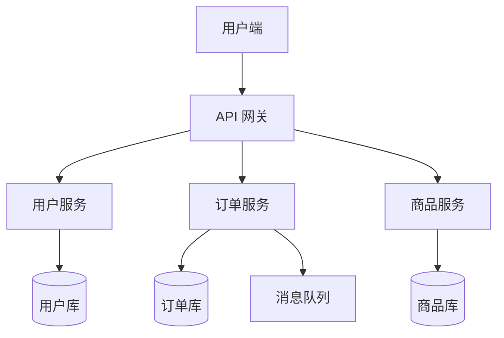

# 微服务架构设计

## 概述

本文档描述电商平台的微服务架构设计，指导后续开发实施。

## 架构图



## 服务拆分

| 服务 | 职责 | 技术栈 |
|------|------|--------|
| 用户服务 | 注册、登录、信息管理 | Go + PostgreSQL |
| 订单服务 | 下单、支付、退款 | Java + MySQL |
| 商品服务 | 商品CRUD、库存管理 | Python + MongoDB |

## 示例代码

```python
def create_order(user_id, items):
    """创建订单"""
    total = sum(item['price'] * item['qty'] for item in items)
    order = {
        'user_id': user_id,
        'items': items,
        'total': total,
        'status': 'pending'
    }
    return order
```

## 性能公式

平均响应时间：$T_{avg} = \frac{1}{N}\sum_{i=1}^{N} T_i$

吞吐量：$QPS = \frac{N}{T_{total}}$

## 服务对比

| 维度 | 单体架构 | 微服务架构 |
|------|---------|-----------|
| 部署 | 一次部署 | 独立部署 |
| 扩展 | 整体扩展 | 按需扩展 |
| 故障 | 全局影响 | 局部隔离 |
| 复杂度 | 低 | 高 |
