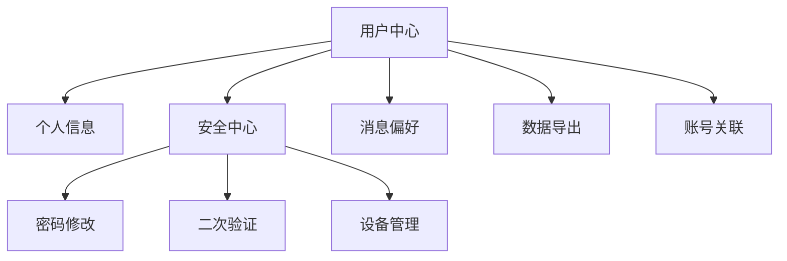

# 用户中心改版 PRD

## 产品简介

用户中心改版 V2.0，帮助普通用户更便捷地管理个人信息和账户安全。

## 功能清单

| 功能名 | 描述 | 优先级 |
|--------|------|--------|
| 个人信息编辑 | 支持头像、昵称、签名修改 | P0 |
| 账户安全中心 | 密码修改、二次验证、登录设备管理 | P0 |
| 消息通知偏好 | 按类型设置通知开关 | P1 |
| 数据导出 | 导出个人数据（JSON/CSV） | P1 |
| 多账号关联 | 绑定第三方账号登录 | P2 |

## 产品架构

## 功能需求

### F1：个人信息编辑（P0）

**功能描述**：用户可修改头像、昵称、个人签名。

**交互规则**：
1. 用户点击「编辑」进入编辑模式
2. 修改完成后点击「保存」提交
3. 系统校验字段合法性，校验通过后保存成功
4. 校验失败时显示具体错误信息

**业务规则**：
- 昵称：2-20 字符，不可包含特殊符号
- 签名：最多 50 字符
- 头像：仅支持 JPG/PNG，大小 ≤ 2MB

**边界情况**：
- 昵称为空时：提示"昵称不能为空"
- 头像超过 2MB：提示"头像文件过大，请压缩后上传"

**验收标准**：
- 当用户修改昵称为合法值时，系统应保存成功并返回个人中心
- 当用户上传超过 2MB 的头像时，系统应提示错误且不保存

### F2：账户安全中心（P0）

**功能描述**：提供密码修改、二次验证开关、登录设备查看和远程登出功能。

**交互规则**：
1. 进入安全中心，展示安全评分（0-100）
2. 各安全项可独立开启/关闭
3. 修改密码需验证旧密码
4. 远程登出需二次确认

**验收标准**：
- 当用户开启二次验证时，系统应要求扫码绑定
- 当用户点击远程登出时，系统应弹出确认框

## 非功能需求

| 指标 | 要求 |
|------|------|
| QPS | ≥ 500 |
| 响应延迟 | ≤ 200ms |
| 可用性 | ≥ 99.9% |
| 并发用户 | ≥ 10000 |

## 附录

- 术语表：无
- 参考资料：用户调研报告 2024-Q1
